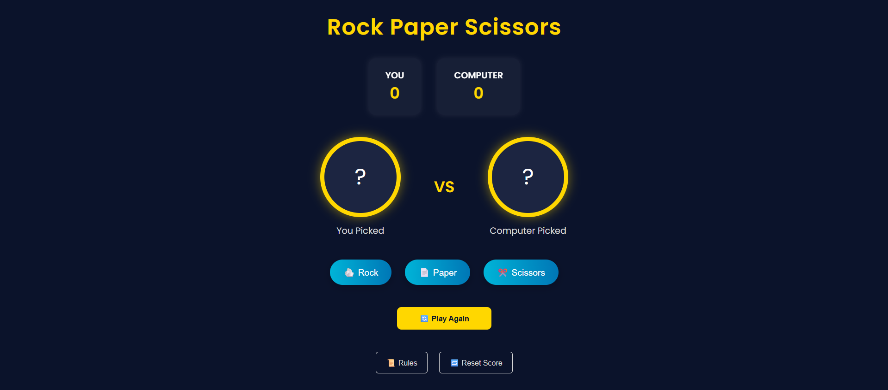

# 🪨 Rock Paper Scissors - Web Game

A modern Rock Paper Scissors game built using HTML, CSS, and JavaScript.

## 🎮 Features

- Dark-themed UI  
- Random computer moves  
- Score tracking  
- Play again & reset buttons  
- Rules popup  
- Mobile responsive

## 🚀 How to Play

1. Clone or download the project  
2. Open `index.html` in your browser  
3. Start playing – no setup needed!

## 📜 Game Rules

- 🪨 Rock beats ✂️ Scissors  
- 📄 Paper beats 🪨 Rock  
- ✂️ Scissors beats 📄 Paper  

## 📄 License

Free to use and modify (MIT License)
